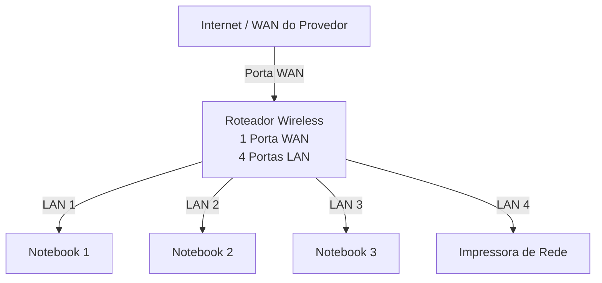

# Laboratório de Redes 01 - Projeto de Rede local

Aluno: Artur correia 

Professor: José de Assis

Data: 09/03/2026

---

## 1. Objetivo
Implementar uma rede local simples conectando 3 notebooks a um roteador wireless com switch e uma impressora de rede.

O projeto será dividido em duas etapas:

1. Simulação da rede no Cisco Packet Tracer
2. Implementação da rede no laboratório real

---

## 2. Equipamentos utilizados neste laboratório:

- 3 notebooks
- 1 roteador wireless com 1 porta WAN e 4 portas LAN
- 1 impressora de rede
- cabos de rede

---

## 3. Topologia da Rede

Diagrama lógico da rede usada neste laboratório.

Imagem da topologia usada neste laboratório:

---

## 4. plano de endereçamento IP

Rede: 192.168.0.0/24

 Gateway: 192.168.0.1

| Dispositivo  | Tipo de IP  | Endereço IP | Observaçao |
|-------------|-------------|-------------|-------------|
| Reteador  | Estatico | 192.168.0.1 | IP do reteador |
| impressora | Reserva DHCP | 192.168.0.101 | IP reservador pelo roteador | 
| PC1 | Reserva DHCP | 192.168.0.102 | IP reservador pelo reteador |
| PC2 | DCHP | Automatico | IP atribuido pelo roteador |
| PC3 | DCHP | Automatico | IP atribuino pelo reteador |

**Observaçao**

